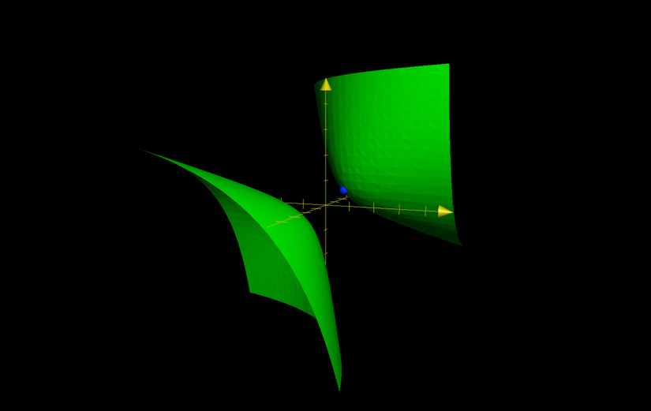



# 微分積分2009
2009年度は設問２,３が微分積分から出題された。

## 設問２（条件付き極値問題）
2020年度の [review](review2020.md) を参照。

### 対称性の利用について
目的関数 $x^2+y^2+z^2$ と、制約条件 $xy+yz+zx=1$ がいずれも3次対称式になっている。この性質を利用して

$$
\left\{
\begin{array}{l}
s = x+y+z \\
t = xy+yz+zx \\
u = xyz
\end{array}
\right.
$$

と変数変換し、解の判別式を使って制約条件も書き換えて解く方法（２変数版は高校数学で頻出）を考えたが、3次方程式の解の判別式が複雑なので現実的ではない。

また、2つ目の参考サイトのように、$x,y$ ２文字の対称性に着目して消去する方法も今回はうまくいかない[^1]。

[^1]:なぜ…？

### 参考
- [3次方程式の解の判別式](https://manabitimes.jp/math/1063)
- [関数の最大・最小（対称式3パターン）](https://examist.jp/mathematics/tahensu-maxmin/taisyousiki/)

## 設問３（不定積分）

以下の不定積分（indefinite integral）を求めよ。

$$
\int\frac{1}{x^2(1-x)^2}dx
$$

被積分関数がよく見る部分分数分解 $\frac{1}{x(x-1)} = \frac{1}{x-1} - \frac{1}{x}$ の２乗になっていることを使って解く。

## 配点例
設問２：13点  
設問３：12点  
（25点満点）

