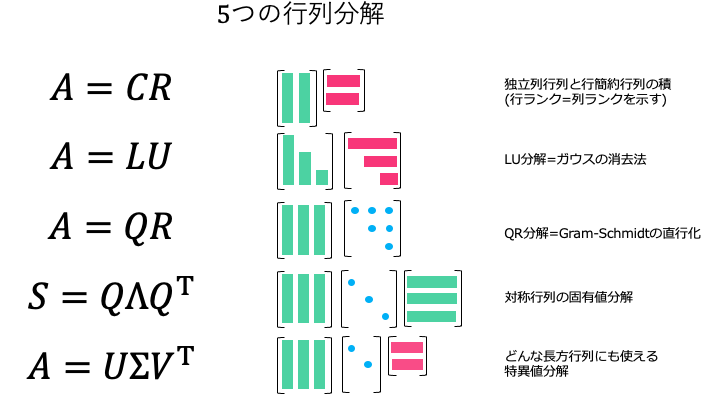



# 線形代数2022

## 設問１（LU分解）
### LU分解の利点
- ２つの行列L,Uを格納するのに必要なメモリは、元の行列Aの格納スペースに等しい[^1]。
- Ax=bの方程式を解くとき、１度LU分解をすればbの値が変化してもすぐに解ける[^2]。Gaussの消去法を使う場合、拡大係数行列を再度階段化し直す必要がある

[^1]:[Qiita記事](https://qiita.com/kenjihiranabe/items/11d07d3cea0325f17851)  
[^2]:[LU分解とGaussの消去法の比較](https://ameblo.jp/renderrender/entry-10582848651.html#:~:text=つまり，LU%20分解する理由,やり直さなくてはならない%EF%BC%8E)

### ５つの行列分解

#### CR分解
$A$ の独立な列行列のみからなる行列 $C$ と、行簡約行列 $R$ の積に分解する。  
行ランクと列ランクが等しいことの証明に使える。  
例：
$$
\begin{align*}
\begin{pmatrix}
1 & 2 & 3 \\
2 & 3 & 5
\end{pmatrix}
&=
\begin{pmatrix}
1 & 2 \\
2 & 3
\end{pmatrix}
\begin{pmatrix}
1 & 0 & 1 \\
0 & 1 & 1
\end{pmatrix} \\

A &= CR
\end{align*}
$$

一般に $A:m\times n,\ C:m\times c,\ R:c\times n$ とするとき、$A$ の列ランクは $C$ の列数 $c$ である。また、$R$ の行ベクトルは $R$ が行簡約が独立であることより、$A$ の行ランクは、

#### LU分解
#### QR分解
#### 固有値分解
#### 特異値分解

### プログラム
解答の確認に使ったプログラム
- [ans_check.py](codes/ans_check.py)
- [LU_original.py](codes/LU_original.py)
- [LU_scipy.py](codes/LU_scipy.py)：科学計算ライブラリを使ったLU分解。浮動小数点で計算するため結果にズレが生じる？

## 設問２（四元数の正方行列表現）
四元数はコンピュータビジョンと関係がある[^3]。出題者が西野教授…？

[^3]:[Wikipedia](https://ja.wikipedia.org/wiki/四元数)
